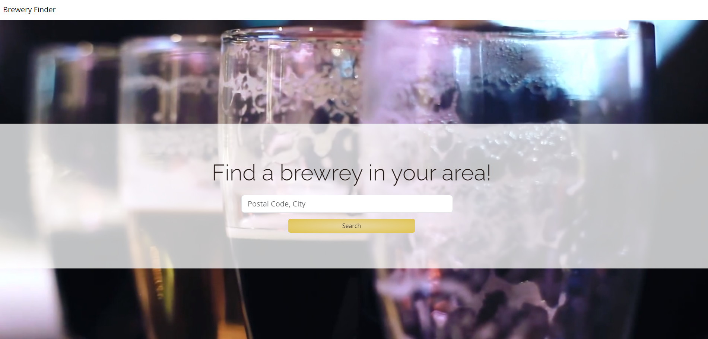
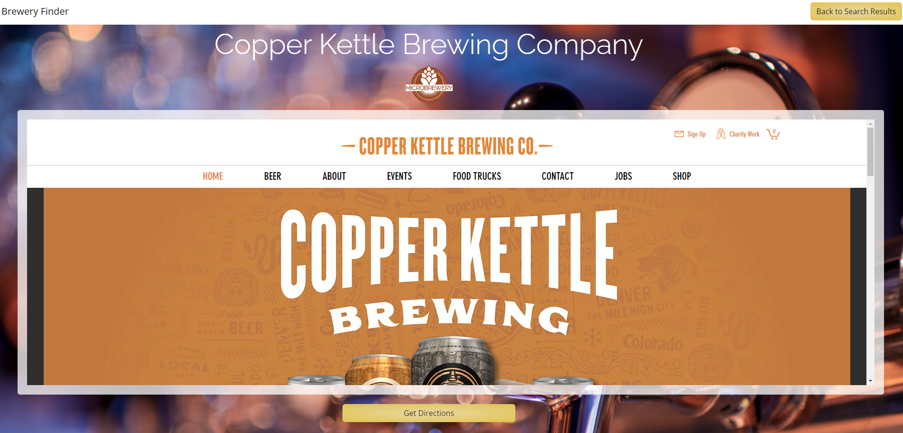
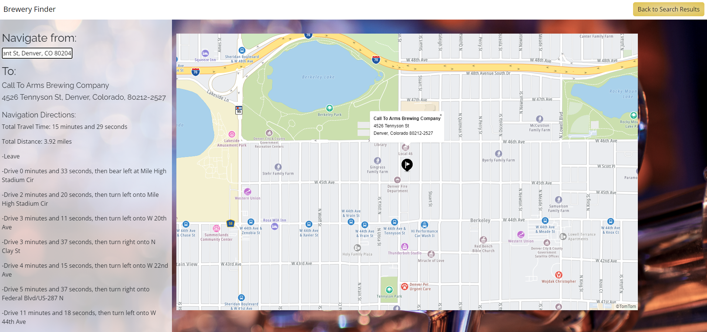

# Brewery Finder

## Description

This web application, Brewery Finder, was developed to help anyone find breweries, cideries, brewpubs, and bottleshops in their nearby areas. The motivation behind this project was to create a simple way for a user to locate a brewery and get directions in the same webpage application. Through third party API sources, Open Brewery DP and TomTom, the webpage was able to have the source information needed for functionality. With this web application, a user only has to go to one webpage to find the breweries in their area as well as the directions to that brewery instead of using multiple applications to find their desired destination and how to get there.

[Here is a link to the webpage](https://ronbuttermore.github.io/brewery-finder/).

---
---

## Table of Contents (Optional)

If your README is long, add a table of contents to make it easy for users to find what they need.

- [Brewery Finder](#brewery-finder)
- [Usage](#usage)
- [Credits](#credits)
- [License](#license)

---
---

## Brewery Finder

### Main Load Page

The main page is a simple invitation to learn more about the breweries in your local area.

### Search Result Page

The search result page displays all of the results in the area searched for. There is also an option to look for another area at the top of the page.

### Brewery Information Page

The brewery information page displays the website of the brewery. Here, the user can gain more knowlage about the brewery to better know if they would like to get directions there.

### Directions Page

The directions page helps navigate from the user’s location to the desired brewery.

---

## Usage

### Main Load Page Usage

The usage of the main page is equally simple to the design. Simply input the postal code or city of the searchable location and click on the search button. If the location inputted is not a city or zip code, a dismissable alert will pop up requesting a new input.

### Search Result Page Usage

To use the search results page, simply scroll through the options provided. There are two buttons for each search result that allow the user to either learn more about the brewery or to get directions to that brewery. In addtion, the Brewery Finder in the top left will bring the user back to the main page index.

### Brewery Information Page Usage

If the user clicked on the button in the search results page to learn more about the brewery, this page will display that information. From here, the user can click on the get directions button to move into the navigation page.

### Directions Page Usage

Once the user has selected their brewery and to get directions there, they can put in their starting location to receive navigational directions. 

---

## Credits

Project was worked on collaboratively by:
Ron Buttermore: https://github.com/ronbuttermore
Deni Ensign: https://github.com/deepsnow6
Sarah Paterson: https://github.com/Sarah-Paterson

Open Brewery DB: https://www.openbrewerydb.org/ A free dataset and API with public information on breweries, cideries, brewpubs, and bottleshops.

TomTom API: https://developer.tomtom.com/ APIs and SDKs powered by TomTom’s real-time maps and traffic data, with global coverage and advanced functionalities.

Video by Distill from Pexels: https://www.pexels.com/video/drinking-beer-852342/
Photo by Pixabay from Pexels: https://www.pexels.com/photo/stainless-steel-beer-dispenser-159291/

Helpful Resources:
W3 School’s information about JavaScript, HTML, and CSS: https://www.w3schools.com/
Stack Overflow’s answered questions about JavaScript: https://stackoverflow.com/
MDN’s information on JavaScript: https://developer.mozilla.org/en-US/
Google.com helping find the above resources
The Bootcamp gitLab DU-VIRT-FSF-PT-04-2023-U-LOLC repository

The README template I used was provided by The Full-Stack Blog: https://coding-boot-camp.github.io/full-stack/github/professional-readme-guide

---

## License

### MIT Licence
Please see the license for more details.
